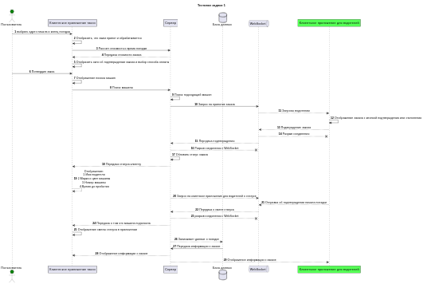
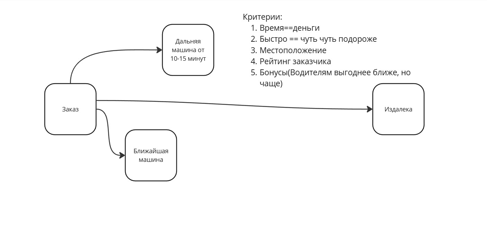

# Тестовое задание от Kode

## Тестовое задание 1

## Тестовое задание 2

`Бизнес захотел добавить вызов такси другому человеку. Подумай какие вопросы ты бы мог задать заказчику для того чтобы в дальнейшем спроектировать эту функциональность`

 Вопросы для заказчика:

1. На какое количество заказов нужно сделать?(Если нужно развести например 20 человек)
2. Нужно ли добавлять раздельную оплату счетов или все оплачивает один человек?
3. Нужен ли функционал для добавления маломобильных людей?
4. Требуеться возможность другому человеку, если он находится на другой локации?
5. Добавлять ли чекбокс для определения будет ли человек с багажом или нет?

## Тестовое задание 3

Добавление нового функционала
`Сервис доставки такси выяснил что назначение ближайшего такси на вызов  не самый эффективный вариант для распределения заказов. Они столкнулись с недовольством пользователей так как алгоритм поиска машины работал долго и неэффективно`

1. Предложение первым сделать запрос на такси которое уже едет, так как водитель может оставить машину и отойти покурить, попить кофе или есть.
2. Распределенный заказ в радиусе 10-15 минут езды, т.е. сделать запрос на ближний, потом на дальний так больше вероятности принятии заказа.
3. Так же понять причину отказа от заказов, может водители сразу видят цену.
4. Проверка района если это бандитский район, думаю мало кто будет брать заказ.
5. Бонусная система
6. Добавить тариф и рейтингы для водителей
